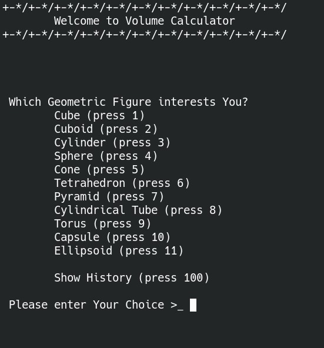
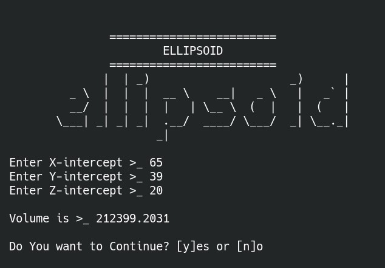
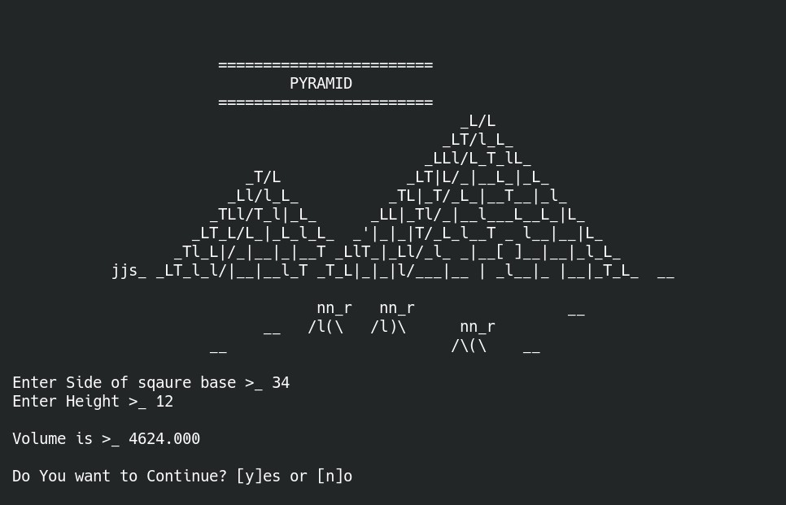
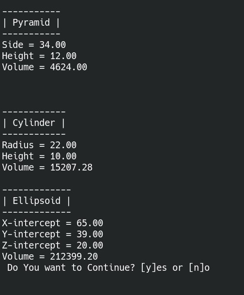
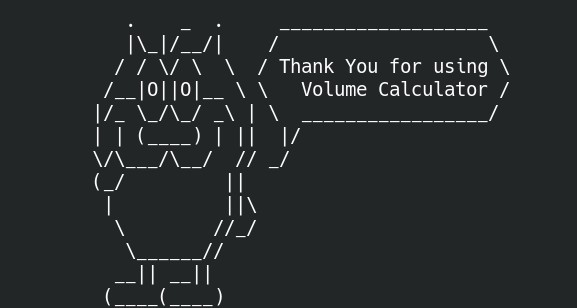

# Volume-Calculator
> Find volumes of various geometric figures with some *ASCII* art :).

`volume.c` is the main file.


And `ascii_generator.h` is the header file which contains functions printing amazing *ascii* art.


## Initial Menu


## Few Examples

### Cylinder


### Ellipsoid


### Pyramid


### History


### Bye-bye



## Note for platform-compatibility
1. For `Linux` :
  Runs Perfectly.
  
  
2. For `Windows` :


  You might need to **change** some *system* functions like -
  ```C
  system("clear");
  ```
  and
  ```C
  system("sleep");
  ```
  and thats it.
